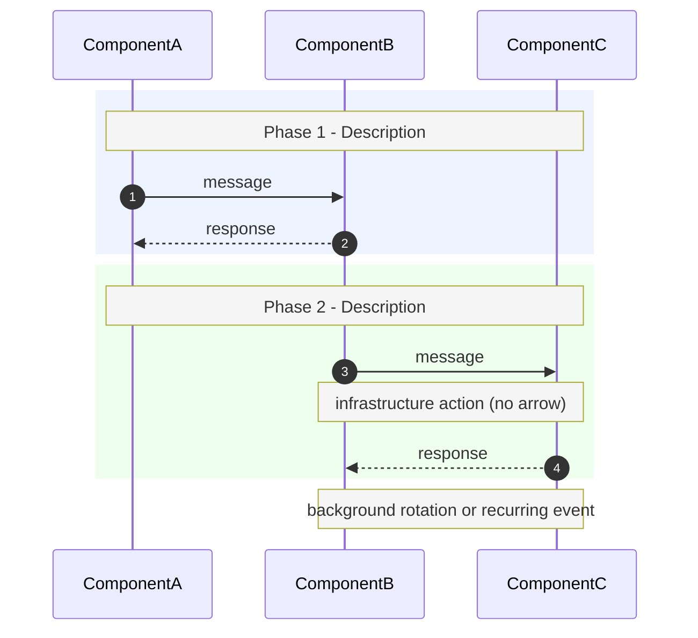

# Mermaid sequenceDiagram 繪圖技巧

從 SPIRE-Istio PoC 時序圖的反覆修正中整理出的實戰規則。
以下規則優先順序高於直覺。

---

## 使用時機

需要繪製或修改 Mermaid `sequenceDiagram` 時，**先讀本 skill**，再動手。

---

## 1. 會讓 Mermaid 崩潰的字元（最高優先）

| 危險字元 | 現象 | 替換方式 |
|---|---|---|
| `;` 在 Note 文字裡 | statement terminator，整張圖 parse error | 改用 `,` 或 `.` |
| `&lt;` `&gt;` HTML entity | parse error | 直接用 `NS`、`SA` 等 ASCII placeholder |
| `—`（em-dash）、`→`、`：`（全形）| parse error | 改用 `-`、`->`、`:` |
| 中文字在 arrow label 或 Note 裡 | 可能導致 parse error 或 GitHub render 異常 | Note / label 只用英文；中文只放在 triple-backtick 外的 Markdown |
| `//` double slash 在 arrow label | 偶發 parse error | 改用 `via` 或空格分隔 |

**原則：arrow label 和 Note 全部只用 ASCII。**

---

## 2. Note 溢出修正

`Note over` 的顯示寬度取決於指定的 participant range：

```
# 錯誤：只指定最右側 participant，文字往右溢出
Note over EN: Phase E - Envoy SDS direct to SPIRE Agent

# 正確：指定最左到最右，Note 跨全寬
Note over Kind,EN: Phase E - Envoy SDS direct to SPIRE Agent
```

**規則：重要的 Phase 標題一律用 `Note over 最左,最右:`。**

---

## 3. Participant 排列順序

左到右應對應「呼叫方向的主軸」，讓 arrow 盡量向右流動（同向比較易讀）：

```
# k8s + SPIRE + Istio 場景的建議順序
participant Kind as Kind cluster        # 叢集入口 / orchestrator
participant IS  as istiod               # mutating webhook（最早介入）
participant OPA as OPA Gatekeeper       # validating webhook
participant CM  as Controller Manager   # SPIRE control plane
participant SS  as SPIRE Server         # SPIRE control plane
participant SA  as SPIRE Agent+CSI      # SPIRE data plane
participant EN  as Envoy sidecar        # workload
```

Participant 順序也決定 `Note over A,B:` 的視覺範圍，排序錯誤會讓 Note 只覆蓋一部分。

---

## 4. Kubernetes admission 順序

Kubernetes 的 webhook 呼叫順序是：

```
1. Mutating admission webhooks（istiod sidecar injection 在此）
2. Schema validation
3. Validating admission webhooks（OPA Gatekeeper 在此）
```

**不要把 OPA 畫在 istiod 前面**，否則架構說明不準確。

```
# 正確 Phase A 畫法
Kind->>IS: kubectl apply Deployment (mutating webhook)
IS-->>Kind: inject Envoy (spire template + CSI volume)
Kind->>OPA: validating webhook
OPA->>OPA: L1/L2/L3
OPA-->>Kind: admit
```

---

## 5. 基礎設施操作用 Note，不用 Arrow

下面這類操作不是「A 呼叫 B 的協定訊息」，用 Arrow 會誤導讀者：

- CSI Driver 掛載 volume 進 pod（kubelet 觸發，不是 Envoy 呼叫 CSI）
- initContainer 等待 socket 出現
- DaemonSet 在 node 啟動

**正確做法：全部改用 `Note over`。**

```
# 錯誤：暗示 Envoy 主動呼叫 CSI Driver
EN->>SA: wait-for-spire-socket

# 正確：描述 infrastructure 行為
Note over Kind,EN: CSI Driver mounts agent.sock into pod volume
Note over Kind,EN: initContainer waits until socket ready
```

---

## 6. 強調「繞過」某元件

當架構重點是「cert 不走 istiod」時，要在 Phase 標題 + 加一行 Note 同時說明：

```
rect rgb(255, 255, 238)
    Note over Kind,EN: Phase E - Envoy SDS (cert path bypasses istiod)
    Note over IS,EN: istiod distributes xDS config (routes/policy) - cert path is direct to SPIRE
    EN->>SA: SDS request via CSI socket
    ...
end
```

**原則：「不走某元件」這件事本身就是架構決策，值得畫出來。**

---

## 7. 視覺設定

```
%%{init: {'theme': 'default', 'themeVariables': {'noteBkgColor': '#f5f5f5', 'noteTextColor': '#333', 'activationBkgColor': '#e8e8e8'}}}%%
sequenceDiagram
    autonumber
```

- `autonumber`：每條 arrow 自動加步驟編號，方便 review 時指出「第 N 步有問題」
- `rect rgb(R, G, B)`：用低飽和度淺色（如 `238,244,255`）區隔 Phase，深色會讓文字難讀
- Phase 內第一行一定是 `Note over 最左,最右: Phase X - ...`

---

## 8. 完整範本骨架



---

## 可攜性說明

這個 skill 存放於 repo 的 `.claude/commands/mermaid-sequence-diagram.md`。
任何 clone 此 repo 的機器，在 Claude Code 裡執行 `/mermaid-sequence-diagram` 即可載入。

若要在**其他 repo** 使用：
1. 複製此檔案到目標 repo 的 `.claude/commands/` 目錄
2. 或在 `~/.claude/commands/` 放一份（user-level，所有 repo 皆可用）
