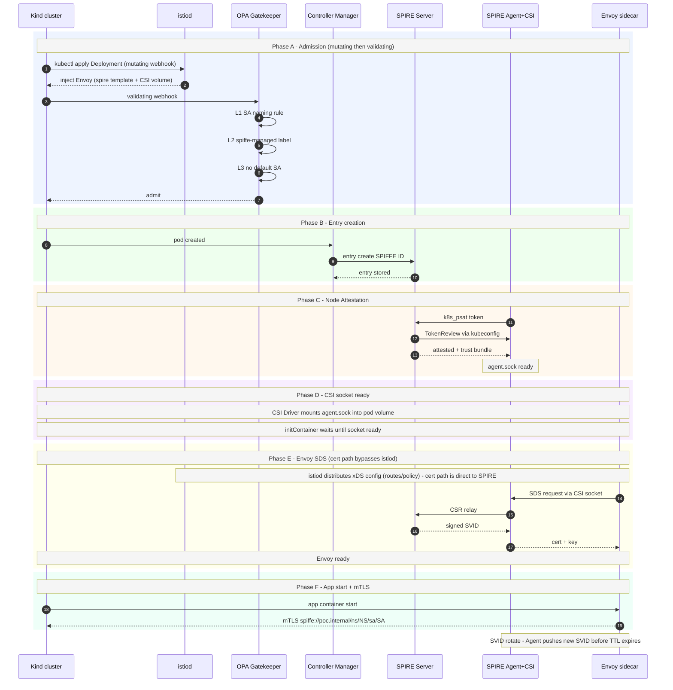

# [PoC] SPIRE × Istio mTLS — Kind 本地驗證環境

---

## Repo 目錄結構

```
kind-spire-istio-poc/
├── Makefile                        # 一鍵啟動：make all / make check / make clean
├── versions.env                    # 所有元件版本集中管理
│
├── kind/
│   └── kind-config.yaml            # Kind cluster 設定（單節點）
│
├── spire-server/
│   └── server.conf                 # SPIRE Server 設定（host process，模擬外部 VM）
│
├── spire/
│   ├── values-agent.yaml           # SPIRE Agent Helm chart values
│   ├── controller-manager-config.yaml  # SPIRE Controller Manager 設定
│   └── cluster-spiffeid.yaml       # ClusterSPIFFEID CRD（自動建立 SPIRE entry 規則）
│
├── istio/
│   ├── istio-operator.yaml         # IstioOperator（SPIFFE CSI Driver + ingress gateway 整合）
│   └── validation-gateway/
│       ├── values.yaml             # Helm values（pilotCertProvider=istiod 保留 xDS CA mount）
│       ├── post-renderer.sh        # Helm post-renderer（CSI volume / env / SA rename patch）
│       └── patch-csi-volume.yaml   # （備用，實際由 post-renderer 處理）
│
├── gatekeeper/
│   ├── constraint-templates/       # OPA ConstraintTemplate CRD（四條規則的 schema）
│   │   ├── k8sforbiddefaultserviceaccount.yaml
│   │   ├── k8srequiredspiffelabel.yaml
│   │   ├── k8svalidserviceaccountname.yaml
│   │   └── k8svalidspiffeprincipal.yaml
│   └── constraints/                # OPA Constraint（實際生效的 policy 物件）
│       ├── enforce-sa-naming.yaml
│       ├── no-default-sa.yaml
│       ├── require-spiffe-label.yaml
│       └── valid-spiffe-principal.yaml
│
├── test/
│   ├── good-sa-deployment.yaml     # payment-gateway（SA 命名合規，spiffe-managed=true）
│   ├── bad-sa-deployment.yaml      # OPA 拒絕範例（SA 命名違規）
│   ├── payment-core-deployment.yaml
│   ├── peer-authentication.yaml    # STRICT mTLS（istio-validation namespace）
│   └── payment-core-authz-policy.yaml  # AuthorizationPolicy（只允許 payment-gateway-sa）
│
├── scripts/
│   ├── 00-create-kind-cluster.sh
│   ├── 01-start-spire-server.sh    # 下載 binary，以 host process 啟動
│   ├── 02-install-spire-agent.sh   # Helm 安裝 SPIRE Agent + SPIFFE CSI Driver
│   ├── 03-start-controller-manager.sh  # Docker 啟動 Controller Manager + apply ClusterSPIFFEID
│   ├── 04-install-gatekeeper.sh    # Helm 安裝 OPA Gatekeeper + ConstraintTemplate + Constraint
│   ├── 05-install-istio.sh         # istioctl install（IstioOperator）
│   ├── 06-deploy-test-workloads.sh # 部署測試 workload 到 istio-validation
│   ├── 07-deploy-validation-gateway.sh  # Helm post-renderer 部署 user-namespace gateway
│   └── 08-sanity-check.sh          # 14 section 全面健康檢查（make check）
│
└── docs/
    ├── poc-spire-istio-summary.md         # 本文件：PoC 實作參考、設計決策、驗證指令
    ├── workload-identity-architecture.md  # SPIFFE/SPIRE 概念架構、CA 比較、DR 備份
    └── istio-spire-migration-spec.md      # Istio 維護者遷移操作指南（切換流程、維護成本）
```

---

## 元件清單

| 元件 | 部署位置 | 版本 / Image | 角色 |
|---|---|---|---|
| SPIRE Server | Ubuntu VM（本機 host process） | `1.9.6`（binary） | Central trust authority，簽發 SVID |
| SPIRE Agent | Kind cluster DaemonSet | `ghcr.io/spiffe/spire-agent:1.9.6` | Node attestation，暴露 Workload API socket |
| SPIRE Controller Manager | 與 SPIRE Server 同機 Docker | `ghcr.io/spiffe/spire-controller-manager:0.6.6` | 自動管理 SPIRE registration entry 生命週期 |
| SPIFFE CSI Driver | Kind cluster DaemonSet（隨 SPIRE Agent chart 安裝） | `ghcr.io/spiffe/spiffe-csi-driver:0.2.3` | 將 SPIRE Agent socket 以 CSI ephemeral volume 掛給各 workload |
| CSI Node Driver Registrar | Kind cluster（SPIFFE CSI Driver sidecar） | `registry.k8s.io/sig-storage/csi-node-driver-registrar:v2.9.4` | 向 kubelet 註冊 CSI driver |
| ClusterSPIFFEID CRD | Kind in-cluster | — | 定義 entry 自動建立規則（template + selector） |
| Kubernetes | Kind | `1.34` | 容器平台 |
| Istio istiod | istio-system namespace | `docker.io/istio/pilot:1.29.4` | 憑證維持 Istio 預設 self-signed，不涉入 SPIRE（見「Istio × SPIRE 整合方式」） |
| Envoy sidecar | 每個 workload pod | `docker.io/istio/proxyv2:1.29.4` | 透過 SPIFFE CSI Driver 直連 SPIRE Agent 的 SDS 取 cert，執行 mTLS |
| OPA Gatekeeper | Kind in-cluster | `openpolicyagent/gatekeeper:v3.18.2` | 強制 SA 命名規則、SPIRE label、principal 格式驗證 |
| Test workload（payment-gateway） | istio-validation namespace | `curlimages/curl:8.10.1` | mTLS 發起方驗證 workload |
| Test workload（payment-core） | istio-validation namespace | `kennethreitz/httpbin:latest` | mTLS 接收方，AuthorizationPolicy 驗證目標 |

> **實作與本文件初版的差異**：本文件初版假設 istiod 可透過
> `PILOT_CERT_PROVIDER=spiffe` 取得自身 SVID 成為 mesh CA/RA，但實測與查證
> Istio 原始碼後確認這個設定值並不存在。真正落地可行、且有 Istio 官方
> 實測範例的整合方式是「Envoy sidecar 透過 SPIFFE CSI Driver 直連 SPIRE
> Agent 拿憑證，完全繞過 istiod」，詳見「Istio × SPIRE 整合方式」一節。
> 完整可執行的實作與腳本見 repo 根目錄 `kind/`、`spire-server/`、`spire/`、
> `istio/`、`gatekeeper/`、`test/`、`scripts/`。

---

## 架構圖（文字版）

```
Ubuntu VM（本機／PoC 環境以 host process 模擬）
├── SPIRE Server
│     ├── bind 0.0.0.0:8081（PoC 實測環境因 port 衝突改用 8082，見 spire-server/server.conf）
│     ├── DataStore: sqlite3（PoC）
│     ├── NodeAttestor: k8s_psat（kubeconfig → Kind API，見下節說明）
│     └── 簽發 SVID
│
└── SPIRE Controller Manager
      ├── 與 SPIRE Server 同機，透過本地 Unix Domain Socket 通訊
      │     （上游 spire-controller-manager 僅支援此模式，不支援跨網路
      │     連線遠端 SPIRE Server，見「SPIRE Controller Manager 部署位置」）
      ├── 透過 kubeconfig 遠端 watch Kind cluster 的 ClusterSPIFFEID / pod / namespace
      └── 自動向 SPIRE Server 建立 / 刪除 entry

Kind cluster（k8s 1.34）
├── spire namespace
│     └── SPIRE Agent (DaemonSet)
│           ├── hostPID: true
│           ├── k8s_psat node attestor（k8s_sat 的官方後繼者，見下節說明）
│           └── /run/spire/agent-sockets/spire-agent.sock（hostPath，
│                 透過 SPIFFE CSI Driver 以 csi.spiffe.io 掛載給各 workload）
│
├── istio-system namespace
│     └── istiod（憑證維持 Istio 預設 self-signed，不涉入 SPIRE）
│
└── workload namespace（label: spiffe-managed=true）
      └── pod（label: spiffe-managed=true,
              annotation: inject.istio.io/templates: "sidecar,spire"）
            ├── Envoy sidecar（native initContainer）
            │     └── cert via SDS ← SPIRE Agent
            │           （經 SPIFFE CSI Driver 直連，繞過 istiod 憑證機制）
            └── App container
```

### 啟動依賴鏈

```
SPIRE Server（外部 VM）
  → SPIRE Agent node attestation 成功
    → agent.sock 建立
      → wait-for-spire-socket initContainer 通過（等待 CSI 掛載的 socket 出現）
        → Envoy sidecar 透過 SPIFFE CSI Driver 直連 SPIRE Agent，SDS 取得 cert
          → App container 啟動
```

### 完整時序圖

以下為完整的運作時序，涵蓋從 Deployment apply 到 App container 啟動的六個 Phase：

| Phase | 步驟 | 主要元件 | 說明 |
|---|---|---|---|
| A — Admission | 1–7 | istiod（mutating）→ OPA Gatekeeper（validating） | `kubectl apply` → istiod mutating webhook 注入 Envoy sidecar + CSI volume → OPA validating webhook 執行 SA 命名 / spiffe label / 禁 default SA 三層規則 → admit |
| B — Entry 自動建立 | 8–10 | Controller Manager → SPIRE Server | Controller Manager 偵測到新 pod，依 ClusterSPIFFEID 向 SPIRE Server 建立 SPIFFE entry |
| C — Node Attestation | 11–13 | SPIRE Agent → SPIRE Server → k8s TokenReview | SPIRE Agent 以 k8s_psat token 完成 node attestation，取得 trust bundle；節點上的 `agent.sock` 就緒 |
| D — CSI socket 就緒 | — | CSI Driver → SPIRE Agent | CSI Driver 將 `agent.sock` bind mount 進 pod；istio-proxy initContainer 等待 socket 出現後繼續 |
| E — Envoy SDS | 14–17 | Envoy → SPIRE Agent → SPIRE Server | Envoy 透過 CSI socket 向 SPIRE Agent 請求 SVID；cert 路徑繞過 istiod（istiod 只推 xDS config，不參與 cert 簽發） |
| F — App 啟動 + mTLS | 18–19 | Envoy + App | Envoy 就緒後 app container 啟動；所有流量以 SPIFFE mTLS 雙向驗證 |
| Rotation | — | SPIRE Agent → Envoy | SVID 到期前 SPIRE Agent 主動推送新 cert，Envoy 熱換不中斷連線 |

> 注意：實測確認 Istio 並不存在 `PILOT_CERT_PROVIDER=spiffe` 這個設定值
> （Istio 原始碼 `pkg/config/constants/constants.go` 中合法值僅有
> `istiod` / `kubernetes` / `k8s.io/*` / `custom` / `none`）。istiod 本身
> 憑證全程維持 Istio 預設 self-signed，不涉入 SPIRE；真正生效的整合方式
> 是每個 workload 的 Envoy sidecar 透過 SPIFFE CSI Driver 直接向 SPIRE
> 要憑證，詳見官方範例 [istio/istio repo
> samples/security/spire/](https://github.com/istio/istio/tree/master/samples/security/spire)。



---

## SPIFFE ID 管理策略

### 採用：1 SA per team/function

不採用 1 SA per Deployment，改以**信任邊界**為切割單位。

#### 切割原則

同一個 SA 的條件：
- 被相同的服務呼叫
- 呼叫相同的下游服務
- 存取相同的資源
- 信任等級相同

#### 範例（istio-validation namespace，實測現況）

```
validation-gateway-sa  → user-namespace ingress gateway（Helm post-renderer 部署）
payment-gateway-sa     → 對外接收請求（ingressgateway → 這裡）
payment-core-sa        → 核心業務邏輯（只被 gateway 層打）
```

#### SPIFFE ID 路徑

Istio 官方文件明確規定 workload 的 SPIFFE ID **必須**符合以下固定格式，**不可客製化**：

```
spiffe://<trust.domain>/ns/<namespace>/sa/<service-account>
```

> 來源：[Istio SPIRE Integration](https://istio.io/latest/docs/ops/integrations/spire/)
> "Istio currently requires a specific SPIFFE ID format for workloads. All registrations must follow the Istio SPIFFE ID pattern: `spiffe://<trust.domain>/ns/<namespace>/sa/<service-account>`"

偏離此格式會導致 Istio policy engine 無法正確解析 namespace / SA，造成 mTLS 驗證或 RBAC 判斷失效。

本 PoC 實測（trust domain `poc.internal`，`istio-validation` namespace）：

```
spiffe://poc.internal/ns/istio-validation/sa/validation-gateway-sa
spiffe://poc.internal/ns/istio-validation/sa/payment-gateway-sa
spiffe://poc.internal/ns/istio-validation/sa/payment-core-sa
```

#### SPIRE entry 管理方式

採用 **SPIRE Controller Manager + ClusterSPIFFEID**，entry 全部自動管理：

```yaml
apiVersion: spire.spiffe.io/v1alpha1
kind: ClusterSPIFFEID
metadata:
  name: istio-workloads
spec:
  spiffeIDTemplate: >-
    spiffe://poc.internal
    /ns/{{ .PodMeta.Namespace }}
    /sa/{{ .PodSpec.ServiceAccountName }}
  podSelector:
    matchLabels:
      spiffe-managed: "true"
  namespaceSelector:
    matchExpressions:
      - key: spiffe-managed
        operator: In
        values: ["true"]
```

路徑 template 固定使用 Istio 要求的格式（不可客製化，見上方「SPIFFE ID 路徑」說明）。
Controller Manager 自動偵測 pod 建立 / 刪除，同步向外部 SPIRE Server 建立或清理 entry。

> `.PodSpec.ServiceAccountName`：實測確認 SPIRE Controller Manager 的
> template 欄位是 `PodSpec.ServiceAccountName`（不是 `PodMeta.ServiceAccountName`，
> ServiceAccountName 屬於 pod 的 spec 而非 metadata）。

**需要在 namespace 與 pod 加 label：**

```bash
# namespace
kubectl label namespace payment spiffe-managed=true

# Deployment template
spec:
  template:
    metadata:
      labels:
        spiffe-managed: "true"
```

**SPIRE Controller Manager 部署位置：實測發現與原設計不同**

原設計預期 Controller Manager 跑在 Kind in-cluster、遠端連線外部 SPIRE Server。
查證官方文件後發現這是硬性限制。

> **官方 README 原文**（[spiffe/spire-controller-manager](https://github.com/spiffe/spire-controller-manager/blob/main/README.md)）：
>
> *"designed to be deployed in the same pod as the SPIRE Server. It communicates with the SPIRE Server API using a private Unix Domain Socket within a shared volume."*

設定文件（[spire-controller-manager-config.md](https://github.com/spiffe/spire-controller-manager/blob/main/docs/spire-controller-manager-config.md)）中連線設定僅有 `spireServerSocketPath`（預設 `/spire-server/api.sock`），**沒有任何 TCP / remote address 選項**，確認不支援跨網路連線。

因此本 PoC 改為：

- Controller Manager 與 SPIRE Server 跑在**同一台 host**（PoC 環境即模擬「外部 VM」的那台機器），共用本地 Unix Domain Socket
- Controller Manager 透過標準 kubeconfig（`KUBECONFIG` 環境變數）**遠端**監控 Kind cluster 的 `ClusterSPIFFEID` / Pod / Namespace，這是 controller-runtime 的標準能力，不需要 Controller Manager 本身跑在該叢集裡
- 因此 Controller Manager 的**行為**（entry 自動建立/清理）與原設計完全相同，差異只在**部署位置**

**Production 含意：** SPIRE Server 若以 StatefulSet 跑在 k8s in-cluster，Controller Manager 應作為同一 Pod 的 **sidecar container**；若 SPIRE Server 跑在外部 VM，Controller Manager 必須部署在同一台 VM 上。

`ClusterSPIFFEID` 的 CRD apiVersion 為 `spire.spiffe.io/v1alpha1`（目前唯一版本，從 SPIRE v1.0 起穩定）。
CRD 必須**先於** Controller Manager 安裝，否則會找不到 `ClusterSPIFFEID` kind 而失敗。

```bash
# Step 1：在 Kind cluster 裝 CRD chart
helm repo add spiffe https://spiffe.github.io/helm-charts-hardened
helm repo update

helm upgrade --install --create-namespace \
  -n spire spire-crds spiffe/spire-crds --version 0.5.0

# 確認 CRD 建立完成再繼續
kubectl api-resources --api-group spire.spiffe.io
# 預期看到：
# clusterspiffeids              spire.spiffe.io/v1alpha1   false   ClusterSPIFFEID
# clusterfederatedtrustdomains  spire.spiffe.io/v1alpha1   false   ClusterFederatedTrustDomain
# clusterstaticentries          spire.spiffe.io/v1alpha1   false   ClusterStaticEntry

# Step 2：在 SPIRE Server 所在的 host 上，用官方 image 啟動 Controller Manager
# （設定檔內容見 spire/controller-manager-config.yaml）
docker run -d --name spire-controller-manager \
  --network host \
  -e ENABLE_WEBHOOKS=false \
  -e KUBECONFIG=/kubeconfig \
  -v "$(pwd)/spire/controller-manager-config.yaml:/config.yaml:ro" \
  -v /opt/spire/conf/server/kubeconfig:/kubeconfig:ro \
  -v /tmp/spire-server/private:/tmp/spire-server/private \
  ghcr.io/spiffe/spire-controller-manager:0.6.6 \
  --config /config.yaml
```

完整可執行版本見 `scripts/03-start-controller-manager.sh`。

**1 SA per team/function 下的 entry 數量：**

```
payment namespace（3 個 SA，20 個 pod）
  → entry 只有 3 筆（SA 層級）
  → Controller Manager 偵測到同 SA 的 entry 已存在，不重複建
  → pod 數量不影響 entry 數量
```

#### AuthorizationPolicy 範例

```yaml
apiVersion: security.istio.io/v1beta1
kind: AuthorizationPolicy
metadata:
  name: payment-data-policy
  namespace: payment
spec:
  selector:
    matchLabels:
      spiffe-sa: payment-data
  action: ALLOW
  rules:
    - from:
        - source:
            # 注意：Istio AuthorizationPolicy 的 principals 官方格式為
            # "<trustdomain>/ns/<ns>/sa/<sa>"，不含 "spiffe://" 前綴。
            # 實測確認寫成完整 URI 會被 RBAC 引擎判定
            # matched_policy[none] 而拒絕存取，即使憑證 SAN 完全相符。
            principals:
              - "corp.internal/ns/payment/sa/payment-core-sa"
```

---

## Node Attestation 方式

> **plugin 更正**：本文件初版使用 `k8s_sat`，但實測時 SPIRE 1.9.6 server
> 啟動即警告該 plugin 已棄用（deprecated），官方後繼者是 `k8s_psat`
> （projected/bound service account token）。官方 Helm chart（`spiffe/spire`）
> 的 agent 端也只原生支援切換 `k8s_psat`，沒有 `k8s_sat` 的開關。
> 因此本 PoC 全面改用 `k8s_psat`，語意與「PoC 用 kubeconfig / Production
> 用 OIDC」的設計決策完全相同，只是 plugin 名稱不同。

### PoC 環境（Kind + 同一台機器）

SPIRE Server 透過 kubeconfig 打 Kind API Server做 `TokenReview`：

```
SPIRE Agent → PSAT (projected token) → SPIRE Server → Kind API TokenReview → attestation 完成
```

原因：Kind 不開放 OIDC discovery endpoint，只能用 kubeconfig 方式。

```hcl
# server 端（實測可行版本，見 spire-server/server.conf）
NodeAttestor "k8s_psat" {
  plugin_data {
    clusters = {
      "kind-spire-istio-poc" = {
        service_account_allow_list = ["spire:spire-agent"]
        audience                   = ["spire-server"]
        kube_config_file           = "/opt/spire/conf/server/kubeconfig"
      }
    }
  }
}
```

### Production 環境（真實 k8s cluster）

改用 OIDC Discovery，不需要 kubeconfig：

```hcl
NodeAttestor "k8s_psat" {
  plugin_data {
    clusters = {
      "c1" = {
        service_account_allow_list = ["spire:spire-agent"]
        audience                   = ["spire-server"]
        # 省略 kube_config_file：SPIRE Server 跑在叢集內時可用 in-cluster
        # ServiceAccount 直接呼叫 TokenReview API，或改用 OIDC Discovery
        # 驗證 PSAT 簽章，不需要额外的 kubeconfig
      }
    }
  }
}
```

---

## DataStore 說明

### PoC 階段：sqlite3

sqlite3 是 SPIRE Server 內建支援的嵌入式資料庫，資料存在單一檔案，不需要額外安裝。

```hcl
DataStore "sql" {
  plugin_data {
    database_type     = "sqlite3"   # PoC 用
    connection_string = "/opt/spire/data/server/datastore.sqlite3"
  }
}
```

PoC 建議使用 sqlite3 的原因：
- 零額外安裝，SPIRE binary 內建支援
- 排查路徑短，出問題只有一個檔案
- PoC 目標是驗證 SPIRE + Istio 整合，不是驗證 DB 層

### Production 階段：PostgreSQL

切換只需修改 `server.conf` 的 DataStore 段落，plugin 名稱維持 `"sql"` 不變：

```hcl
DataStore "sql" {
  plugin_data {
    database_type     = "postgres"
    connection_string = "dbname=spire user=spire password=secret host=your-pg-host sslmode=require"
  }
}
```

**切換流程：**

```bash
# 1. 建立 PostgreSQL DB
CREATE DATABASE spire;
CREATE USER spire WITH PASSWORD 'your-password';
GRANT ALL PRIVILEGES ON DATABASE spire TO spire;

# 2. 修改 server.conf（database_type + connection_string）

# 3. 重啟 SPIRE Server
systemctl restart spire-server
spire-server healthcheck

# 4. Controller Manager 自動 reconcile
# entry 不需要手動匯出匯入
# Controller Manager 根據現有 ClusterSPIFFEID + pod 狀態自動重建所有 entry

# 5. 確認 entry 重建完成
spire-server entry show
```

**sqlite3 vs PostgreSQL 比較：**

| | sqlite3（PoC） | PostgreSQL（Production） |
|---|---|---|
| 安裝需求 | 無（SPIRE 內建） | 需要獨立 DB server |
| 多機 HA | 不支援 | 支援 |
| 資料持久化 | 單一 .sqlite3 檔案 | DB server 管理 |
| 切換方式 | 修改 server.conf + 重啟 | — |
| entry 遷移 | Controller Manager 自動重建 | — |

> PoC 後期如需驗證切換流程，可單獨做一次 sqlite3 → PostgreSQL 的演練，
> 確認 Controller Manager 能自動重建 entry。

---

## Trust Domain 設定

| 環境 | Trust domain |
|---|---|
| PoC | `poc.internal` |
| Production（建議） | `mesh.your-corp.internal` |

規則：
- 全小寫，格式像 domain name
- 不需要能實際 DNS 解析
- 一旦設定**不能更改**（改了等於重建整個 PKI）
- c1 / c2 雙 cluster 必須使用**同一個** trust domain

---

## Istio × SPIRE 整合方式

> **本節取代文件初版的「PILOT_CERT_PROVIDER 說明」**。實測 + 查證 Istio
> 1.29.4 原始碼（`pkg/config/constants/constants.go`）確認 `PILOT_CERT_PROVIDER`
> 合法值只有 `istiod` / `kubernetes` / `k8s.io/<signer>` / `custom` / `none`，
> **沒有 `spiffe` 這個值**。「istiod 取得自身 SVID 變成 mesh RA」這個設計
> 在目前 Istio 並不存在，以下是實測驗證過、真正可行的整合方式。

### PILOT_CERT_PROVIDER（istiod 自身憑證，與 SPIRE 無關）

| 值 | CA 來源 | cacerts Secret 需要？ | 說明 |
|---|---|---|---|
| `istiod`（預設，無 cacerts，本 PoC 採用） | istiod self-signed | 不需要 | istiod 自動產生 root CA，完全自治 |
| `istiod` + cacerts Secret | 你提供的外部 CA（BYOCA） | **需要** | istiod 載入 cacerts 裡的 CA 簽發 cert |
| `kubernetes` | k8s 內建 CA | 不需要 | 透過 k8s CSR API 取 cert |

本 PoC 中 istiod 的憑證維持**預設值**（`istiod` self-signed），完全不受
SPIRE 影響——因為 istiod 自身憑證只用來保護 istiod ↔ Envoy 之間的 XDS
控制平面通道，跟「workload 之間的 mTLS 身份要由誰簽發」是兩件事。

### 真正的 SPIRE 整合點：SPIFFE CSI Driver + SDS

Istio 官方支援、且有實測範例（[istio/istio repo
samples/security/spire/](https://github.com/istio/istio/tree/master/samples/security/spire)）
的整合方式，是讓**每個 workload 的 Envoy sidecar 直接向 SPIRE 要憑證**，
完全繞過 istiod：

```
Envoy sidecar
  → 掛載 SPIFFE CSI Driver（csi.spiffe.io）提供的 ephemeral volume
  → volume 底層是 SPIRE Agent 的 Workload API socket 的 bind mount
  → Envoy 用 SDS 協定透過這個 socket 直接向 SPIRE Agent 要憑證
  → SPIRE Agent 向 SPIRE Server 取得 signed SVID
  → 憑證 Issuer/Subject 為 "O = SPIRE"（而非 istiod 的 self-signed CA）
```

**IstioOperator 設定**（自訂 sidecar injection template，只有加上
annotation 的 workload 才會套用）：

```yaml
apiVersion: install.istio.io/v1alpha1
kind: IstioOperator
spec:
  profile: default
  meshConfig:
    trustDomain: poc.internal
    accessLogFile: /dev/stdout
  components:
    pilot:
      k8s:
        env:
          - name: ENABLE_NATIVE_SIDECARS
            value: "true"
  values:
    sidecarInjectorWebhook:
      templates:
        spire: |
          spec:
            # native sidecar 模式（Istio 1.29）：istio-proxy 是 initContainer
            # 必須 patch initContainers 而非 containers
            initContainers:
            - name: istio-proxy
              env:
              # 告訴 pilot-agent 改連 SPIRE Agent socket 取 cert
              - name: CA_ADDR
                value: unix:///run/secrets/workload-spiffe-uds/socket
              - name: PILOT_CERT_PROVIDER
                value: spiffe
              volumeMounts:
              - name: workload-socket
                mountPath: /run/secrets/workload-spiffe-uds
                readOnly: true
            volumes:
              - name: workload-socket
                csi:
                  driver: "csi.spiffe.io"
                  readOnly: true
```

**Workload 要 opt-in**才會套用這個 template（不是 mesh-wide 強制）：

```yaml
metadata:
  labels:
    spiffe-managed: "true"        # 給 SPIRE ClusterSPIFFEID 用，建立 entry
  annotations:
    inject.istio.io/templates: "sidecar,spire"   # 套用上面自訂的 spire template
```

### CA_ADDR 與 socket 路徑設定鏈

`CA_ADDR=unix:///run/secrets/workload-spiffe-uds/socket` 這個值不是任意的，每一段都對應到不同層的設定：

```
[SPIRE Agent Helm chart]
  spire-agent DaemonSet
  hostPath → /run/spire/agent-sockets/      ← 節點上的真實 socket 目錄
                                               由 SPIRE Helm chart 預設定義

       ↓  SPIFFE CSI Driver 讀此目錄

[SPIFFE CSI Driver DaemonSet]
  /spire-agent-socket 掛載節點的 /run/spire/agent-sockets/
  以 driver: "csi.spiffe.io" 暴露給 pod
  在掛載點內自動建立 symlink：
      socket       -> spire-agent.sock      ← CA_ADDR 用此 symlink
      api.sock     -> spire-agent.sock      ← 舊版相容
      spire-agent.sock                      ← 真實 socket 檔案

       ↓  pod 裡的 CSI volume

[istio-operator.yaml — spire sidecar template]
  volumes:
    - csi:
        driver: "csi.spiffe.io"             ← 向 CSI Driver 申請 volume
  volumeMounts:
    - mountPath: /run/secrets/workload-spiffe-uds  ← pod 內掛載點（可自訂）

       ↓  pilot-agent 啟動時讀取

[CA_ADDR = unix:///run/secrets/workload-spiffe-uds/socket]
                                 ↑                    ↑
                        sidecar template 的       SPIFFE CSI Driver
                        mountPath（可自訂）        建立的固定 symlink 名稱
```

**三個設定的對應關係：**

| 設定值 | 定義位置 | 說明 |
|---|---|---|
| `/run/spire/agent-sockets/` | SPIRE Agent Helm chart hostPath | 節點上 socket 的來源目錄 |
| `csi.spiffe.io` | sidecar template `volumes.csi.driver` | 向 SPIFFE CSI Driver 申請 volume 的 driver 名稱 |
| `/run/secrets/workload-spiffe-uds` | sidecar template `volumeMounts.mountPath` | pod 內掛載點，**可自訂** |
| `socket` | SPIFFE CSI Driver 自動建立的 symlink | **固定名稱**，不需手動設定 |

**重要：** 若修改 sidecar template 的 `mountPath`，`CA_ADDR` 必須同步修改：

```
mountPath: /custom/path  →  CA_ADDR: unix:///custom/path/socket
```

**驗證憑證確實由 SPIRE 簽發**（`istioctl proxy-config secret` +
`openssl x509`）：

```bash
istioctl pc secret -n payment "$POD" -o json | \
  python3 -c "import json,sys,base64; d=json.load(sys.stdin); \
    print(base64.b64decode(d['dynamicActiveSecrets'][0]['secret']['tlsCertificate']['certificateChain']['inlineBytes']).decode())" \
  | openssl x509 -text -noout | grep -E "Issuer|Subject|URI"

# 預期輸出：
#   Issuer: C = US, O = SPIFFE, ...
#   Subject: C = US, O = SPIRE
#   URI:spiffe://poc.internal/ns/payment/sa/payment-gateway-sa
```

### SPIFFE CSI Driver Volume：Production 考量

CSI volume 是 istiod mutating webhook 透過 `spire` template 注入進 pod spec 的。在 production 有三個必須注意的點：

**1. SPIFFE CSI Driver DaemonSet 必須先於 workload 就緒**

kubelet 啟動 pod 時會向該 node 上的 CSI driver（`csi.spiffe.io`）要求 volume mount。若 DaemonSet 尚未在該 node 上 Running，pod 卡在 `ContainerCreating`，錯誤訊息：

```
MountVolume.SetUp failed for volume "workload-socket":
kubernetes.io/csi: attacher.MountDevice failed to create newCsiDriverClient:
driver name csi.spiffe.io not found in the list of registered CSI drivers
```

緩解方式：
- Helm 安裝 SPIRE Agent chart 時加 `--wait`，或 `kubectl rollout status daemonset/spire-agent -n spire` 確認就緒再繼續 deploy workload
- SPIFFE CSI Driver DaemonSet 加 `PodDisruptionBudget`，保護滾動升級時不中斷

**2. Opt-in 粒度維持 annotation，不改為 mesh-wide 強制**

`inject.istio.io/templates: "sidecar,spire"` 是 workload 層級的 opt-in。建議維持此方式：

| namespace | 建議 | 原因 |
|---|---|---|
| `kube-system` / `istio-system` | 不加 annotation | 系統元件不需要 SPIRE identity |
| `spire` / `gatekeeper-system` | 不加 annotation | 基礎設施元件自管身份 |
| business workload namespace | 加 annotation | 需要 mTLS + SPIRE SVID |

若強制所有 pod 套用 `spire` template，基礎設施 pod 會嘗試掛載 CSI volume，若 CSI Driver 尚未就緒或 namespace 未被 SPIRE 管理，會導致啟動失敗。

**3. SPIRE Agent socket 路徑與 UID 權限**

SPIFFE CSI Driver 透過 hostPath bind mount 把 SPIRE Agent socket 暴露給 pod。Production 注意事項：

- 若 SPIRE Agent 以 non-root UID 執行，需確認 socket file permission 讓 Envoy sidecar 的 UID 可讀（建議設 `g+rw` 並讓兩者同 GID，或明確設 `0666`）
- SPIRE Agent 滾動升級期間 socket 短暫消失，會導致新 pod 的 Envoy SDS 請求失敗、pod 卡在 init 阶段；建議 DaemonSet 採 `maxUnavailable: 1`，並監控 CSI volume mount error

---

### 重要實測發現：PERMISSIVE mTLS 模式下 AuthorizationPolicy 會誤判拒絕

即使 Envoy 已透過 SPIRE 簽發的憑證完成 TLS handshake、debug log 也顯示
`uriSanPeerCertificate` 與 `AuthorizationPolicy` 設定的 principal 完全相符，
在預設 `PERMISSIVE` mTLS 模式下仍會出現：

```
rbac_access_denied_matched_policy[none]
```

改用 `STRICT` 模式後才正確生效（HTTP 200）：

```yaml
apiVersion: security.istio.io/v1beta1
kind: PeerAuthentication
metadata:
  name: default
  namespace: payment
spec:
  mtls:
    mode: STRICT
```

**結論：透過 SPIFFE CSI Driver 取得 SPIRE 憑證的 workload，所在 namespace
必須設定 `STRICT` mTLS，`AuthorizationPolicy` 的 RBAC principal 比對才會
正確生效。** 完整可執行版本見 `istio/istio-operator.yaml`、
`test/peer-authentication.yaml`。

---

## User Namespace 自建 IngressGateway 注意事項

以下為透過 Helm chart（`istio-ingress`）在 user namespace 部署 IngressGateway 並整合 SPIRE 的實測經驗。PoC 驗證環境：`istio-validation` namespace，部署腳本見 `scripts/07-deploy-validation-gateway.sh`。

### 1. Helm chart `workload-socket` 硬寫 `emptyDir`，必須 post-renderer

chart 沒有 values 可以改 volume type。若直接用 kustomize strategic merge patch，會把 `emptyDir` 和 `csi` 合併成同一個 volume spec（k8s 禁止一個 volume 同時含兩種類型），必須用 Python 精確替換：

```python
for i, v in enumerate(spec.get('volumes', [])):
    if v.get('name') == 'workload-socket':
        spec['volumes'][i] = {'name': 'workload-socket',
                              'csi': {'driver': 'csi.spiffe.io', 'readOnly': True}}
```

### 2. `pilotCertProvider=spiffe` 會移除 `istiod-ca-cert` mount，xDS 會 crash

**workload cert（SVID）** 和 **xDS 控制平面 TLS** 是兩條獨立路徑：

| 路徑 | 說明 | 負責方 |
|---|---|---|
| xDS TLS | pilot-agent ↔ istiod gRPC（port 15012） | `istiod-ca-cert` mount |
| workload mTLS cert | Envoy ↔ SPIRE Agent SDS | `CA_ADDR` + `PILOT_CERT_PROVIDER` env |

chart 在 `pilotCertProvider != istiod` 時會條件性移除 `istiod-ca-cert` volume 和 volumeMount，導致 pilot-agent 啟動時找不到 `var/run/secrets/istio/root-cert.pem` 而 crash。

**正確做法**：values 保留 `pilotCertProvider: istiod`（chart 保留 xDS CA cert mount），post-renderer 只覆寫 `CA_ADDR` 和 `PILOT_CERT_PROVIDER` env var：

```yaml
# values.yaml
global:
  pilotCertProvider: "istiod"  # 保留，讓 chart 保留 istiod-ca-cert mount
```

```python
# post-renderer: 覆寫 env
for env in container.get('env', []):
    if env['name'] == 'CA_ADDR':
        env['value'] = 'unix:///run/secrets/workload-spiffe-uds/socket'
    elif env['name'] == 'PILOT_CERT_PROVIDER':
        env['value'] = 'spiffe'
```

### 3. SA 命名必須符合 OPA 規則

chart 自動產生的 SA 名稱是 `{{ gateway.name }}-service-account`，不符合 OPA `enforce-sa-naming` Constraint 的 pattern `^[a-z0-9-]+-(?:gateway|core|data|egress|worker|internal)-sa$`。

post-renderer 需同時 patch 三處以保持一致性：

```python
# ServiceAccount metadata.name
# Deployment spec.serviceAccountName
# RoleBinding subjects[].name
```

### 4. Namespace 和 Pod 都要加 `spiffe-managed: "true"`

`istio-workloads` ClusterSPIFFEID 的雙層 selector：

```
namespaceSelector: spiffe-managed=true  ← namespace 必須有此 label
podSelector:       spiffe-managed=true  ← pod 必須有此 label
```

兩者缺一，Controller Manager 不建 SPIRE entry，gateway 靜默拿不到 SVID。**User namespace 正確加 label 後不需要額外建 ClusterSPIFFEID**（`istio-system` 是例外，因為不能亂加 label，才需要獨立的 `istio-ingressgateway` ClusterSPIFFEID）。

### 5. SVID 是 lazy 初始化

Gateway Envoy 不會主動發 SDS 請求，需有 TLS-configured `Gateway` resource 且有流量通過才觸發。部署後 `istioctl proxy-config secret` 看不到 active secret 是正常的，驗證時只需確認：

- SPIRE entry 存在（`spire-server entry show | grep <namespace>`）
- `workload-socket` volume type 為 `csi.spiffe.io`（非 `emptyDir`）
- `CA_ADDR` env 指向 SPIRE socket

### 快速 Checklist

```
□ values.yaml: pilotCertProvider=istiod（保留 xDS CA cert mount）
□ post-renderer patch 1: workload-socket emptyDir → csi.spiffe.io
□ post-renderer patch 2: CA_ADDR / PILOT_CERT_PROVIDER env override → SPIRE
□ post-renderer patch 3: SA rename 符合 OPA 命名規則（三處同步）
□ namespace label: spiffe-managed=true + istio-injection=enabled
□ pod label: spiffe-managed=true（在 values.yaml gateways.*.labels 加）
□ 確認 SPIRE entry 建立：spire-server entry show | grep <namespace>
```

### 透過 ArgoCD 部署的替代方案

ArgoCD Application CRD 的 Helm source 不支援 `--post-renderer`，需改用以下其中一種方式：

**方案 A：Kustomize + helmCharts（推薦，ArgoCD 原生支援）**

在 git repo 放 `kustomization.yaml`，以 JSON6902 `op: replace` 替換整個 volume entry（不會產生 emptyDir + csi 並存問題）：

```yaml
# kustomization.yaml
helmCharts:
- name: istio-ingress
  releaseName: validation-ingressgateway
  namespace: istio-validation
  valuesFile: values.yaml

patches:
- patch: |-
    - op: replace
      path: /spec/template/spec/volumes/0
      value:
        name: workload-socket
        csi:
          driver: csi.spiffe.io
          readOnly: true
  target:
    kind: Deployment
    name: validation-ingressgateway
```

ArgoCD Application 改為 Kustomize source，不再使用 Helm source。缺點：`/volumes/0` 依賴 index 不變，chart 升級時需確認 volume 順序。

**方案 B：ArgoCD Config Management Plugin（CMP）**

在 `argocd-repo-server` 加 sidecar，把 post-renderer script 包成 plugin，Application 指定 `source.plugin.name`。最靈活，但需要修改 ArgoCD 本身的部署，維護成本較高。

**方案 C：Pre-rendered manifests**

CI pipeline 離線執行 `helm template + post-renderer`，commit 靜態 YAML 到 git，ArgoCD 直接 apply。不需要任何 plugin，但每次 chart 或 values 更新都要重新渲染並 commit。

| 方案 | 適用場景 |
|---|---|
| A（Kustomize + helmCharts） | 希望完全 GitOps，chart 版本升級自動同步 |
| B（CMP） | 需要複雜 patch 邏輯、有能力改 ArgoCD infra |
| C（Pre-rendered） | 快速驗證、或 chart 不常更新 |

---

## Istio Revision 安裝與 Namespace Injection Label

### Revision 模式的影響

Istio 支援以 revision 方式安裝多個控制平面版本並行（如 `istioctl install --revision 1-29`）。Revision 模式下，MutatingWebhookConfiguration 改為監聽 `istio.io/rev` label，**`istio-injection: enabled` 完全被忽略**。

| 安裝方式 | Namespace label | Sidecar 是否注入 |
|---|---|---|
| Default（本 PoC） | `istio-injection: enabled` | ✓ |
| Revision（`1-29`） | `istio-injection: enabled` | ✗（靜默失敗） |
| Revision（`1-29`） | `istio.io/rev: 1-29` | ✓ |

若 namespace 只有 `istio-injection=enabled` 而 Istio 以 revision 安裝，sidecar 不會被注入，`spire` template 不套用，SPIRE 整合完全失效（不報錯）。

### Production 建議做法

**改用 revision label：**

```yaml
metadata:
  labels:
    istio.io/rev: "1-29"      # 替換 istio-injection: enabled
    spiffe-managed: "true"    # 不變
```

**若 namespace 不加 injection label，改在 pod 層指定：**

```yaml
# Deployment pod template annotations
inject.istio.io/inject: "true"
inject.istio.io/templates: "sidecar,spire"
```

**加 `PeerAuthentication STRICT` 補網（讓失敗可見）：**

沒有 Envoy sidecar 的 pod 無法建立 mTLS 連線，立即失敗而非靜默通過。

```yaml
apiVersion: security.istio.io/v1beta1
kind: PeerAuthentication
metadata:
  name: default
  namespace: payment
spec:
  mtls:
    mode: STRICT
```

**加 OPA Constraint 在 admission 層補網：**

新增 `K8sRequireIstioSidecar` Constraint，確認 `spiffe-managed=true` 的 pod 含 `istio-proxy` container，admission 直接拒絕未注入的 pod，防止靜默失效進入叢集。

---

## 優點

| 優點 | 說明 |
|---|---|
| 統一 trust authority | 所有 mTLS 身份由同一個外部 SPIRE Server 背書 |
| 跨系統身份可驗證 | 外部服務可透過 SPIRE trust bundle 驗證 SVID |
| SA 數量可控 | 1 SA per team/function，不會隨 Deployment 線性增長 |
| Istio 官方支援路徑 | SPIFFE CSI Driver + SDS 整合方式在 1.29.4 已有官方實測範例 |
| SPIFFE ID 標準格式 | 維持 Istio 預設路徑，與生態系工具相容 |
| AuthorizationPolicy 正常運作 | 憑證 SAN 符合 Istio 預設格式，principal 比對無灰色地帶（需搭配 STRICT mTLS，見「Istio × SPIRE 整合方式」） |
| 未來擴展性 | 架構可平滑升級，不被鎖死（見下方說明） |

### 未來擴展性說明

「未來擴展性」指的是**你們自己的架構可以漸進升級**，不是等待 Istio 版本：

```
現在：1 SA per team/function（本 PoC）
       ↓ 需要更細時
中間：1 SA per Deployment（OPA Gatekeeper 強制）
       ↓ 需要路徑客製化時
未來：ClusterSPIFFEID + Controller Manager（繞過 istiod）
```

每一步都可以獨立決定，現在的選擇不會造成日後重建 PKI 或更換 trust domain 的代價。

#### Istio 社群關於更細顆粒度的討論

目前 Istio 的 SPIFFE ID 路徑格式由 istiod 程式碼固定，SPIRE 只能被動簽發。
社群有相關討論，但尚無明確實作時間表：

- **GitHub Issue #43105**：[Customizing SPIFFE ID format if using an external SPIFFE-compliant SDS should be supported](https://github.com/istio/istio/issues/43105)
  - 提出讓外部 SDS（如 SPIRE）控制 SPIFFE ID 格式，不被 Istio 預設格式鎖死
  - 目前的限制：Envoy 的 SPIFFE SAN validation 是 hardcoded exact match，即使 SPIRE 簽發了更細的路徑，Envoy 驗證時仍要求符合 `/ns/<ns>/sa/<sa>` 格式
  - 若使用客製化路徑，目前需要透過 `DestinationRule` 手動設定 SAN matching 才能繞過此限制

- **Istio 官方文件**：[SPIRE 整合](https://istio.io/latest/docs/ops/integrations/spire/)
  - 明確說明目前 Istio 要求 SPIFFE ID 必須符合 `/ns/<namespace>/sa/<service-account>` 格式
  - Controller Manager 可自動建立符合此格式的 entry

#### 目前可行的更細顆粒度做法（需繞過限制）

根據 Solo.io 的技術文件，若要做到 pod 層級顆粒度，需要：

```
# 客製化路徑（需搭配 DestinationRule SAN matching）
spiffe://corp.internal/ns/<ns>/sa/<sa>/node/<node>/wl/<workload_name>

# DestinationRule 設定（否則 Envoy SAN validation 會失敗）
trafficPolicy:
  tls:
    subjectAltNames:
      - "spiffe://corp.internal/ns/payment/sa/payment-core-sa/node/.*/wl/.*"
```

這個方式技術上可行但需要額外維護 DestinationRule，且為 regex matching，
不在 Istio 官方支援路徑內。

---

## 缺點

| 缺點 | 說明 |
|---|---|
| SPIFFE ID 路徑無法客製化 | Envoy 的 SAN 驗證邏輯 hardcode 要求 `/ns/<ns>/sa/<sa>` 格式，SPIRE Server 只能被動配合 |
| 顆粒度上限是 SA 層級 | 同一 SA 的不同 Deployment 無法在 policy 層區分 |
| SPIRE Server 是額外元件 | 需要獨立維護，不在 k8s 內部 |
| PoC 用 sqlite3 | 不適合 production，需換 PostgreSQL |
| kubeconfig 管理（PoC） | Kind 環境需手動複製 kubeconfig，production 改 OIDC |

---

## 風險

| 風險 | 嚴重度 | 說明 | 緩解方式 |
|---|---|---|---|
| SPIRE Server SPOF | 高 | 掛掉則所有新 pod 無法啟動（native sidecar） | Production 需 HA（PostgreSQL + 多台 VM） |
| SVID TTL 到期 | 中 | Server 掛超過 TTL（預設 1hr），已跑 pod 也受影響 | 調長 TTL 或確保 SPIRE HA |
| SPIFFE CSI socket 不存在 | 高 | wait-for-spire-socket initContainer 卡住，該 pod 無法啟動 | 確保 SPIFFE CSI Driver DaemonSet 先於 workload 就緒 |
| trust domain 設錯 | 高 | 設定後無法更改，改了要重建所有 SVID | PoC 前想清楚命名，production 用前確認 |
| Controller Manager 與 SPIRE Server 連線中斷 | 中 | 新 pod 無法自動建 entry → 取不到 SVID | 確保 Controller Manager → SPIRE Server 網路可達，加監控 |
| sqlite3 資料遺失 | 中（PoC） | 所有 entry 消失，需重建 | PoC 可接受；因 Controller Manager 自動 reconcile，切換 PostgreSQL 後 entry 會自動重建 |
| PERMISSIVE mTLS 下 AuthorizationPolicy 誤判拒絕 | 中（PoC 實測發現） | SPIRE 簽發憑證的 workload 在 PERMISSIVE 模式下，RBAC 引擎可能判定 `matched_policy[none]` 而 403，即使憑證 SAN 完全相符 | 該 namespace 一律設定 `PeerAuthentication` STRICT，見「Istio × SPIRE 整合方式」 |
| spire-controller-manager 不支援遠端 Server | 中（PoC 實測發現） | 官方僅支援與 SPIRE Server 同機 UDS 通訊，誤以為可跨網路連線會導致部署卡住 | Controller Manager 與 SPIRE Server 同機部署，透過 kubeconfig 遠端管理叢集資源 |
| Istio 升級相容性 | 低 | Istio 官方 SPIFFE CSI Driver 整合方式（`samples/security/spire/`）為社群長期維護的範例 | 升級前確認 release notes |

---

## Out of Scope（Production 階段）

- SPIRE Server HA（PostgreSQL + 多台 VM）
- DataStore 從 sqlite3 切換至 PostgreSQL（修改 server.conf + 重啟，Controller Manager 自動重建 entry）
- c2 cluster 接入（OIDC attestation）
- SPIRE Server 健康狀態監控 / alerting
- `insecure_bootstrap` → trust bundle 替換
- OPA Gatekeeper audit 定期掃描歷史不合規 SA
- Layer 4 principal 格式驗證擴展至 PeerAuthentication
- Controller Manager 與外部 SPIRE Server 的連線安全（mTLS）

---

## 架構決策紀錄（ADR）

| 決策 | 選擇 | 原因 |
|---|---|---|
| SPIFFE ID 顆粒度 | 1 SA per team/function | SA 數量可控，完全走官方支援路徑 |
| OPA Gatekeeper 命名策略 | pattern 取代白名單 | 全域一筆 Constraint，不隨 namespace 增長 |
| SPIFFE ID 路徑 | Istio 預設格式（`/ns/<ns>/sa/<sa>`） | Envoy SAN 驗證邏輯 hardcode 此格式，走官方支援路徑、AuthorizationPolicy 無灰色地帶 |
| entry 管理 | SPIRE Controller Manager + ClusterSPIFFEID | 自動管理 entry 生命週期，消除手動操作風險 |
| SPIFFE ID template | Istio 預設格式（不客製化） | 維持官方支援路徑，AuthorizationPolicy 無灰色地帶 |
| node attestation plugin | k8s_psat（PoC 與 production 皆同） | k8s_sat 已棄用，官方 Helm chart 只原生支援 k8s_psat |
| node attestation 驗證方式 | kubeconfig（PoC）/ OIDC（production） | Kind 不支援 OIDC，production 改用更安全方式 |
| Controller Manager 部署位置 | 與 SPIRE Server 同機（PoC） | 上游工具僅支援本地 UDS，不支援遠端連線 SPIRE Server |
| Istio × SPIRE 憑證整合 | SPIFFE CSI Driver + SDS（workload 層級 opt-in） | `PILOT_CERT_PROVIDER=spiffe` 不存在；此為 Istio 官方實測支援的整合方式 |
| trust domain | `poc.internal` | PoC 隔離，不影響未來 production 命名 |

---

## OPA Gatekeeper v3.18.2 Enhancement

### 版本相容性

| 元件 | 版本 | 相容性 |
|---|---|---|
| OPA Gatekeeper | v3.18.2 | k8s 1.29–1.34 完全支援 |
| Istio CRD 作為 match target | v3.18.2 | AuthorizationPolicy、PeerAuthentication 可作為 constraint match 對象 |
| Rego | 0.68.x（內建） | 完整支援 regex、json 操作 |

### Enhancement 分層說明

#### Layer 1：SA 命名規則強制（取代白名單）

不用逐 namespace 維護白名單，改用全域命名規則 pattern，一筆 Constraint 管所有 namespace：

**ConstraintTemplate：**

```yaml
apiVersion: templates.gatekeeper.sh/v1
kind: ConstraintTemplate
metadata:
  name: k8svalidserviceaccountname
spec:
  crd:
    spec:
      names:
        kind: K8sValidServiceAccountName
      validation:
        openAPIV3Schema:
          # 實測：Gatekeeper v3.18.2 對 CRD schema 驗證較嚴格，
          # properties[spec].properties[parameters] 需明確標註 type: object，
          # 否則 apply 會被 admission webhook 拒絕。
          type: object
          properties:
            pattern:
              type: string
  targets:
    - target: admission.k8s.gatekeeper.sh
      rego: |
        package k8svalidserviceaccountname

        violation[{"msg": msg}] {
          sa := input.review.object.spec.template.spec.serviceAccountName
          pattern := input.parameters.pattern
          not regex.match(pattern, sa)
          msg := sprintf("ServiceAccount '%v' 不符合命名規則 '%v'", [sa, pattern])
        }
```

**Constraint：**

```yaml
apiVersion: constraints.gatekeeper.sh/v1beta1
kind: K8sValidServiceAccountName
metadata:
  name: enforce-sa-naming
spec:
  match:
    kinds:
      - apiGroups: ["apps"]
        kinds: ["Deployment"]
    namespaceSelector:
      matchExpressions:
        - key: kubernetes.io/metadata.name
          operator: NotIn
          values: ["kube-system", "istio-system", "spire", "gatekeeper-system"]
  parameters:
    # 格式：<namespace>-<function>-sa
    # function 允許值：gateway / core / data / egress / worker / internal
    pattern: "^[a-z0-9-]+-(?:gateway|core|data|egress|worker|internal)-sa$"
```

命名範例：

```
payment-gateway-sa   ✓
payment-core-sa      ✓
order-egress-sa      ✓
payment-sa           ✗  沒有 function 層級
checkout-service     ✗  沒有 -sa suffix
payment-new-temp     ✗  不符合規則
```

---

#### Layer 2：SPIRE label 強制

確保 managed namespace 內的 Deployment 都帶 `spiffe-managed: "true"`，
讓 Controller Manager 能正確自動建立 entry：

```yaml
apiVersion: templates.gatekeeper.sh/v1
kind: ConstraintTemplate
metadata:
  name: k8srequiredspiffelabel
spec:
  crd:
    spec:
      names:
        kind: K8sRequiredSpiffeLabel
  targets:
    - target: admission.k8s.gatekeeper.sh
      rego: |
        package k8srequiredspiffelabel

        violation[{"msg": msg}] {
          labels := input.review.object.spec.template.metadata.labels
          not labels["spiffe-managed"] == "true"
          msg := "Deployment pod template 必須包含 label spiffe-managed=true"
        }
---
apiVersion: constraints.gatekeeper.sh/v1beta1
kind: K8sRequiredSpiffeLabel
metadata:
  name: require-spiffe-label
spec:
  match:
    kinds:
      - apiGroups: ["apps"]
        kinds: ["Deployment"]
    namespaceSelector:
      matchLabels:
        spiffe-managed: "true"
```

---

#### Layer 3：禁止使用 default ServiceAccount

確保每個 Deployment 都明確指定 SA，不能依賴 default SA，
避免身份不明確導致 SPIFFE ID 無法追蹤：

```yaml
apiVersion: templates.gatekeeper.sh/v1
kind: ConstraintTemplate
metadata:
  name: k8sforbiddefaultserviceaccount
spec:
  crd:
    spec:
      names:
        kind: K8sForbidDefaultServiceAccount
  targets:
    - target: admission.k8s.gatekeeper.sh
      rego: |
        package k8sforbiddefaultserviceaccount

        violation[{"msg": msg}] {
          sa := input.review.object.spec.template.spec.serviceAccountName
          sa == "default"
          msg := "不允許使用 default ServiceAccount，請明確指定 SA"
        }

        violation[{"msg": msg}] {
          not input.review.object.spec.template.spec.serviceAccountName
          msg := "ServiceAccountName 不能為空，請明確指定 SA"
        }
---
apiVersion: constraints.gatekeeper.sh/v1beta1
kind: K8sForbidDefaultServiceAccount
metadata:
  name: no-default-sa
spec:
  match:
    kinds:
      - apiGroups: ["apps"]
        kinds: ["Deployment"]
    namespaceSelector:
      matchExpressions:
        - key: kubernetes.io/metadata.name
          operator: NotIn
          values: ["kube-system", "istio-system", "spire", "gatekeeper-system"]
```

---

#### Layer 4：AuthorizationPolicy principal 格式驗證

確保 AuthorizationPolicy 裡的 `source.principal` 格式符合 trust domain，
避免因打字錯誤導致 policy 失效（設錯 trust domain 或路徑）：

```yaml
apiVersion: templates.gatekeeper.sh/v1
kind: ConstraintTemplate
metadata:
  name: k8svalidspiffeprincipal
spec:
  crd:
    spec:
      names:
        kind: K8sValidSpiffePrincipal
      validation:
        openAPIV3Schema:
          type: object
          properties:
            trustDomain:
              type: string
  targets:
    - target: admission.k8s.gatekeeper.sh
      # 注意：pattern 不含 "spiffe://" 前綴，因為 Istio AuthorizationPolicy
      # 的 source.principals 官方格式是 "<trustdomain>/ns/<ns>/sa/<sa>"，
      # 不是完整 URI（實測驗證，見「Istio × SPIRE 整合方式」一節）。
      rego: |
        package k8svalidspiffeprincipal

        violation[{"msg": msg}] {
          rule := input.review.object.spec.rules[_]
          principal := rule.from[_].source.principals[_]
          trust_domain := input.parameters.trustDomain
          pattern := sprintf("^%v/ns/[^/]+/sa/[^/]+$", [trust_domain])
          not regex.match(pattern, principal)
          msg := sprintf("principal '%v' 不符合 SPIFFE ID 格式 %v/ns/.../sa/...", [principal, trust_domain])
        }
---
apiVersion: constraints.gatekeeper.sh/v1beta1
kind: K8sValidSpiffePrincipal
metadata:
  name: valid-spiffe-principal
spec:
  match:
    kinds:
      - apiGroups: ["security.istio.io"]
        kinds: ["AuthorizationPolicy"]
  parameters:
    trustDomain: "poc.internal"
```

---

### OPA Gatekeeper 安裝（PoC）

```bash
helm repo add gatekeeper https://open-policy-agent.github.io/gatekeeper/charts
helm repo update

helm install gatekeeper gatekeeper/gatekeeper \
  --namespace gatekeeper-system \
  --create-namespace \
  --version 3.18.2 \
  --set replicas=1 \
  --set auditInterval=60
```

### PoC 驗證順序

```bash
# 1. 確認 Gatekeeper 啟動
kubectl get pods -n gatekeeper-system

# 2. 套用 ConstraintTemplate（要先於 Constraint）
kubectl apply -f constraint-templates/

# 3. 確認 CRD 建立完成
kubectl get constrainttemplates

# 4. 套用 Constraint
kubectl apply -f constraints/

# 5. 測試：建立不符合命名規則的 Deployment（應被擋）
kubectl apply -f test/bad-sa-deployment.yaml
# 預期：admission webhook 拒絕，顯示 violation message

# 6. 測試：建立符合規則的 Deployment（應通過）
kubectl apply -f test/good-sa-deployment.yaml

# 7. 查看 audit 結果（已存在的不合規資源）
kubectl get k8svalidserviceaccountname.constraints.gatekeeper.sh \
  enforce-sa-naming -o jsonpath='{.status.violations}'
```

### Enhancement 總覽

| Layer | Constraint | 保護目標 | 維護成本 |
|---|---|---|---|
| 1 | SA 命名規則（pattern） | 1 SA per team/function 策略不被繞過 | 低（全域一筆） |
| 2 | SPIRE label 強制 | Controller Manager 能正確自動建 entry | 低 |
| 3 | 禁止 default SA | 每個服務都有明確 SPIFFE 身份 | 低 |
| 4 | principal 格式驗證 | AuthorizationPolicy 不因打字錯誤失效 | 低 |

### 加入元件清單

OPA Gatekeeper 版本更新至 v3.18.2：

> 見文件頂部元件清單，OPA Gatekeeper 版本為 `v3.18.2`，
> 負責強制 SA 命名規則、SPIRE label、principal 格式驗證。
